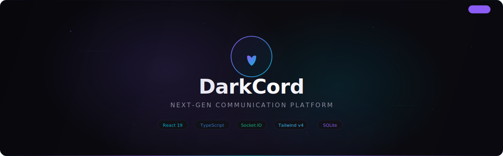
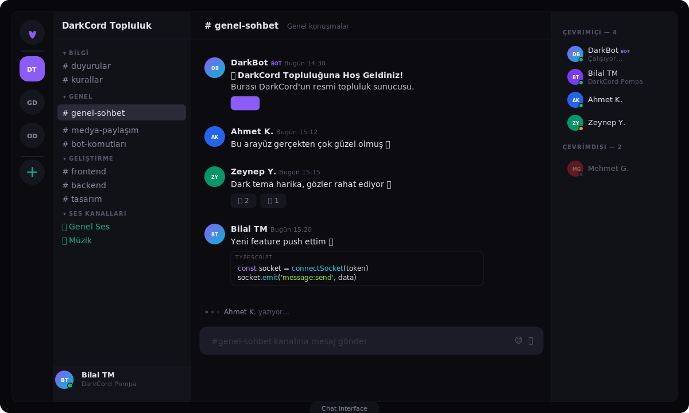
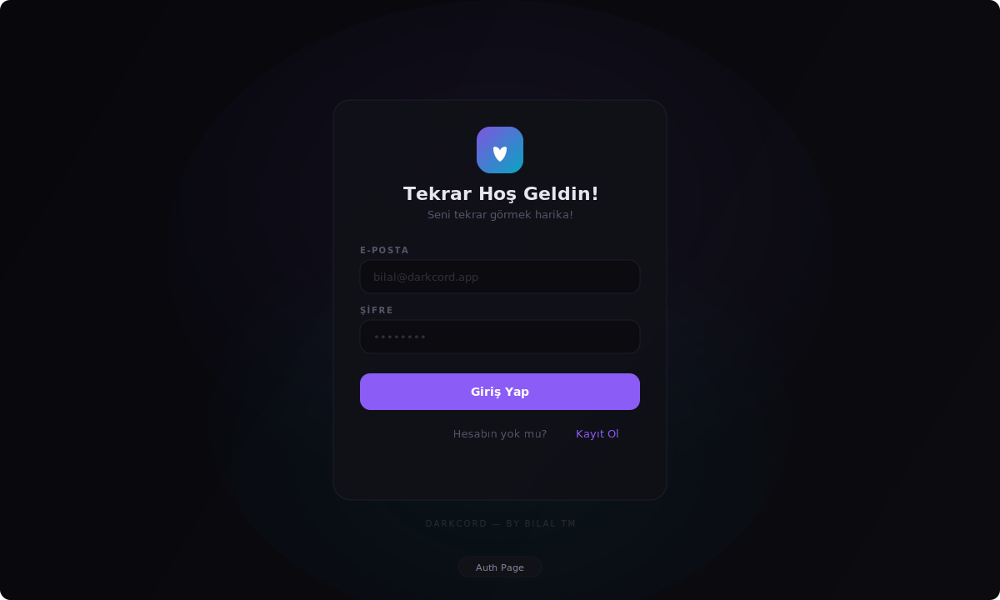
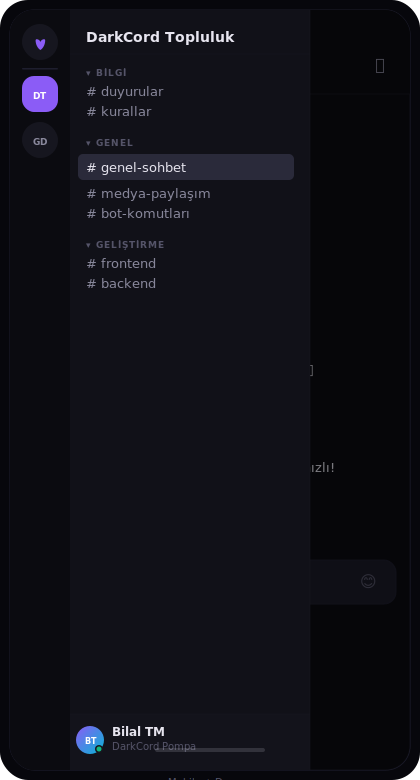

<p align="center">
  
</p>

<p align="center">
  <strong>Next-gen communication platform built with modern web technologies.</strong>
</p>

<p align="center">
  <a href="#-features"></a>
  <a href="#-tech-stack"></a>
  <a href="#-installation"></a>
  <a href="LICENSE"></a>
</p>

<br/>

---

<br/>

## ✨ Features

<table>
<tr>
<td width="50%">

### 💬 Real-Time Messaging
Socket.IO ile anlık mesajlaşma, typing indicators ve online durum göstergeleri.

### 🎨 Custom Theming
Özel tasarlanmış dark theme. Mor-cyan gradient sistemi, glow efektleri ve modern tipografi.

### 🔐 Authentication
JWT + Bcrypt tabanlı güvenli kimlik doğrulama. Register/Login akışı.

</td>
<td width="50%">

### 📱 Fully Responsive
Desktop'tan mobile'a tam responsive. Drawer navigation, touch-friendly arayüz.

### ⚡ Command Palette
`Ctrl+K` ile hızlı erişim. Kanal arama, sunucu değiştirme, ayarlar.

### 🏗️ Server Architecture
Express + SQLite backend. Sunucu oluşturma, kanal yönetimi, üyelik sistemi.

</td>
</tr>
</table>

<br/>

---

<br/>

## 🖥️ Screenshots

<p align="center">
  
</p>

<p align="center">
  <em>Ana sohbet arayüzü — Server Rail, Kanal Listesi, Mesaj Alanı, Üye Listesi</em>
</p>

<br/>

<p align="center">
  
  
</p>

<p align="center">
  <em>Giriş Sayfası &nbsp;•&nbsp; Mobil Görünüm (Drawer Navigation)</em>
</p>

<br/>

---

<br/>

## 🛠 Tech Stack

| Layer | Technology |
|:------|:-----------|
| **Frontend** | React 19, TypeScript 5.9, Vite 5 |
| **Styling** | Tailwind CSS v4, Framer Motion |
| **State** | Zustand 5 |
| **Backend** | Express 5, Socket.IO 4 |
| **Database** | SQLite (better-sqlite3, WAL mode) |
| **Auth** | JWT, bcryptjs |
| **Icons** | Lucide React |

<br/>

---

<br/>

## 📁 Project Structure

```
darkcord/
├── src/
│   ├── components/
│   │   ├── channel-sidebar.tsx    # Kanal listesi
│   │   ├── chat-area.tsx          # Sohbet alanı
│   │   ├── command-palette.tsx    # Ctrl+K palette
│   │   ├── member-list.tsx        # Üye listesi
│   │   ├── server-list.tsx        # Sunucu rail
│   │   └── user-panel.tsx         # Kullanıcı paneli
│   ├── layouts/
│   │   └── app-layout.tsx         # Responsive layout
│   ├── pages/
│   │   └── auth.tsx               # Login / Register
│   ├── store/
│   │   └── app.ts                 # Zustand store
│   ├── lib/
│   │   ├── api.ts                 # REST API client
│   │   └── socket.ts              # Socket.IO client
│   ├── App.tsx                    # Root component
│   └── index.css                  # Design tokens
├── server/
│   ├── index.ts                   # Express entry
│   ├── routes.ts                  # REST endpoints
│   ├── socket.ts                  # Real-time events
│   ├── auth.ts                    # JWT + Bcrypt
│   ├── db.ts                      # SQLite setup
│   └── seed.ts                    # Demo data
├── deploy/
│   ├── nginx.conf                 # Reverse proxy config
│   └── deploy.sh                  # VPS deploy script
├── docs/                          # SVG assets
├── ecosystem.config.cjs           # PM2 config
└── package.json
```

<br/>

---

<br/>

## 🚀 Installation

### Prerequisites

- **Node.js** ≥ 20
- **npm** ≥ 10

### Quick Start

```bash
# Clone
git clone https://github.com/bilaltm/darkcord.git
cd darkcord

# Install
npm install

# Environment
cp .env.example .env

# Run (frontend + backend)
npm run dev:all
```

Frontend: `http://localhost:1420`
Backend API: `http://localhost:3001`

### Environment Variables

```env
PORT=3001
JWT_SECRET=your-secret-key-here
DB_PATH=./data/darkcord.db
CORS_ORIGIN=http://localhost:1420
```

<br/>

---

<br/>

## 📜 Scripts

| Command | Description |
|:--------|:------------|
| `npm run dev` | Frontend dev server (Vite) |
| `npm run server` | Backend server |
| `npm run dev:all` | Both — frontend + backend |
| `npm run build` | Production build |
| `npm run lint` | ESLint check |
| `npm run preview` | Preview production build |

<br/>

---

<br/>

## 🌐 Deploy (VPS)

```bash
# PM2 ile production
npm run build
pm2 start ecosystem.config.cjs

# Nginx reverse proxy
sudo cp deploy/nginx.conf /etc/nginx/sites-available/darkcord
sudo ln -s /etc/nginx/sites-available/darkcord /etc/nginx/sites-enabled/
sudo nginx -t && sudo systemctl reload nginx
```

Detaylı deploy rehberi için `deploy/` klasörüne bakın.

<br/>

---

<br/>

## 🎨 Design System

DarkCord özel bir design token sistemi kullanır:

| Token | Value | Usage |
|:------|:------|:------|
| `--color-bg-primary` | `#0b0b10` | Ana arka plan |
| `--color-bg-secondary` | `#111118` | Sidebar arka plan |
| `--color-accent` | `#8B5CF6` | Vurgu rengi (mor) |
| `--color-cyan` | `#06B6D4` | İkincil vurgu |
| `--color-green` | `#10B981` | Online durumu |
| `--color-text-primary` | `#e8e6f0` | Ana metin |
| `--color-text-muted` | `#56556a` | Soluk metin |

<br/>

---

<br/>

## �️ Roadmap

### ✅ Tamamlananlar

- [x] **Authentication** — JWT + Bcrypt ile register/login, oturum yönetimi
- [x] **Real-Time Messaging** — Socket.IO ile anlık mesajlaşma
- [x] **Typing Indicators** — Kullanıcı yazıyor göstergesi
- [x] **Online/Offline Status** — Gerçek zamanlı kullanıcı durumu
- [x] **Server & Channel System** — Sunucu oluşturma, kanal kategorileri
- [x] **Member List** — Online/offline gruplu üye listesi
- [x] **Message Reactions** — Emoji reaksiyon sistemi
- [x] **Command Palette** — `Ctrl+K` ile hızlı erişim
- [x] **Responsive Design** — Mobile drawer navigation, touch-friendly UI
- [x] **Custom Dark Theme** — Design token sistemi, gradient glow efektleri
- [x] **SQLite Database** — WAL mode, otomatik seed data
- [x] **REST API** — Express 5 ile tam CRUD endpoints
- [x] **Zustand Store** — API + Socket.IO entegre state management
- [x] **VPS Deploy Config** — PM2 + Nginx yapılandırması
- [x] **Code Block Rendering** — Mesajlarda kod bloğu desteği

### 🔜 Yapılacaklar

- [ ] **Voice Channels** — WebRTC ile sesli sohbet
- [ ] **Video Calls** — Birebir ve grup video görüşmesi
- [ ] **Screen Sharing** — Ekran paylaşımı
- [ ] **File Upload** — Dosya/resim gönderme ve önizleme
- [ ] **Message Edit & Delete** — Mesaj düzenleme ve silme
- [ ] **Message Search** — Geçmiş mesajlarda arama
- [ ] **User Profiles** — Profil sayfası, avatar yükleme, bio
- [ ] **Role & Permission System** — Sunucu rolleri ve yetki yönetimi
- [ ] **Direct Messages** — Birebir özel mesajlaşma
- [ ] **Thread / Reply** — Mesaj thread ve yanıt sistemi
- [ ] **Notification System** — Push notification, mention bildirimleri
- [ ] **Rich Embeds** — Link önizleme, YouTube/Spotify embed
- [ ] **Custom Emoji** — Sunucuya özel emoji yükleme
- [ ] **Bot API** — Bot geliştirme SDK'sı
- [ ] **E2E Encryption** — Uçtan uca şifreleme
- [ ] **PWA Support** — Progressive Web App, offline cache
- [ ] **i18n** — Çoklu dil desteği (TR/EN)
- [ ] **Rate Limiting** — API hız sınırlama ve güvenlik

<br/>

---

<br/>

## �📄 License

MIT License — see [LICENSE](LICENSE) for details.

<br/>

---

<p align="center">
  <sub>
    Built with 💜 by <strong>Bilal TM</strong>
  </sub>
</p>
